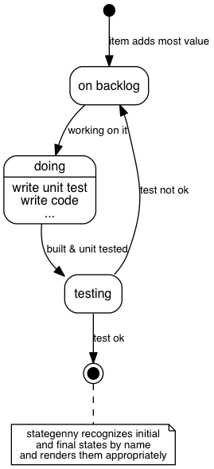

# State-Genny
*Turns text into state charts*

## What?
Makes this



from this
```
initial,
doing: write unit test\nwrite code\n...,
final; # stategenny recognizes initial\nand final states by name\nand renders them appropriately

initial      => "on backlog" : item adds most value;
"on backlog" => doing        : working on it;
doing        => testing      : built & unit tested;
testing      => "on backlog" : test not ok;
testing      => final        : test ok;
```

This first version just emits GraphViz dot => there's plans to change that
soon-ish - see the TODO list below.

## Why
To enable me to make state charts ...
- ... that look _good_
- ... with the least effort possible
- ... whithout having to interact with drag and drop tools. Entering text
  is fine, doing my own layout is not.
- ... without having to dive into GraphViz `dot` each time. Dot is not meant
  to write & maintain conceptual documents in.

## Usage

### Command line interface
`bin/stategenny`

```
Usage: stategenny [options] [infile]

Options:

  -h, --help               output usage information
  -V, --version            output the version number
  -T --output-type <type>  stategenny|dot|json|ast
  -I --input-type <type>   stategenny
  -i --input-from <file>   File to read from. use - for stdin.
  -o --output-to <file>    File to write to. use - for stdout.
  -l --license             Display license and exit
```

... so to convert the above chart to `sample.dot`

```sh
bin/stategenny -T dot doc/sample.stategenny
```

You'll probably want to use that with GraphViz dot for now:

```sh
bin/stategenny -T dot doc/sample.stategenny -o - | dot -T png -odoc/sample.png
```

### Programmatically

```javascript
const stategen = require("./path/to/stategenny");

stategen.translate(
    `
        initial => backlog;
        backlog => doing;
        doing => test;
    `,
    {
        outputType: "dot"
    },
    (pErrror, pSuccess) => console.log(pError || pSuccess)
);
```


## Status
- It's working and tested. Mostly.
- It's very much 0.1.0; there's things I want to do to make
  it pleasant to use before releasing it:

### TODO
- Short term
  - [X] Language: add `--` as a valid forward arrow
  - [X] Language: unit tests for rainy day scenarios (goal: ~80% parser coverage - not 90 or 100 because there's boilerplate code in the parser, which was generated from a peg (and hence is quite reliable anyway))
  - [ ] unit tests for rendering
  - [X] unit tests for the CLI
  - [ ] test coverage > 90%
  - [ ] render with a javascript/ web native library
  - [ ] cook an on line interpreter with that
  - [ ] document the language
- Middle long term
  - [ ]  publish to npm
  - [ ]  add auto-wrap for (at least) notes
  - [ ]  add support for nested states
  - [ ]  add support for orthogonal states
- Long term
  - [ ] create an atom package with
    - [ ] syntax highlighting
    - [ ] previewer (à la atom-mscgen-preview)
  - [ ] create an embedsel lib
  - [ ] parse the _activities_ (state) and _label_ into meaningful attributes
    (activity, condtion, action, ... => see the UML standard)

### flare section
[](https://gitlab.com/sverweij/state-genny/commits/master)
[](https://gitlab.com/sverweij/state-genny/commits/master)
