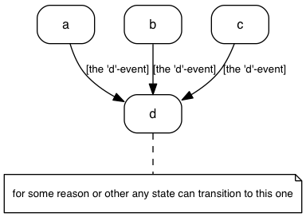

# State-Genny
*Turns text into state charts*

## What?
Makes this


from this
```
initial,
doing: write unit test\nwrite code\n...,
# stategenny recognizes initial
# and final states by name
# and renders them appropriately
final;

initial      => "on backlog" : item adds most value;
"on backlog" => doing        : working on it;
doing        => testing      : built & unit tested;
testing      => "on backlog" : test not ok;
testing      => final        : test ok;
```

## Why
To enable me to make state charts ...
- ... that look _good_
- ... with the least effort possible
- ... whithout having to interact with drag and drop tools. Entering text
  is fine, doing my own layout is not.
- ... without having to dive into GraphViz `dot` each time. Dot is not meant
  to write & maintain conceptual documents in.

## Usage

### Command line interface
`bin/stategenny`

```
Usage: stategenny [options] [infile]

Options:

  -h, --help               output usage information
  -V, --version            output the version number
  -T --output-type <type>  stategenny|dot|json|ast|svg
  -I --input-type <type>   stategenny
  -i --input-from <file>   File to read from. use - for stdin.
  -o --output-to <file>    File to write to. use - for stdout.
  -l --license             Display license and exit
```

... so to convert the above chart to `sample.svg`

```sh
bin/stategenny -T svg doc/sample.stategenny
```

Or, if you'd rather have the native GraphViz dot do that for you:

```sh
bin/stategenny -T dot doc/sample.stategenny -o - | dot -T png -odoc/sample.png
```

### Programmatically

```javascript
const stategen = require("./path/to/stategenny");

stategen.translate(
    `
        initial => backlog;
        backlog => doing;
        doing => test;
    `,
    {
        outputType: "svg"
    },
    (pErrror, pSuccess) => console.log(pError || pSuccess)
);
```

## The language

### Short tutorial

#### simplest
```
on => off;
```


- _stategenny_ automatically declares the states. You _can_ explicitly declare
  them if you want them to have more than a name only - see _explicit state
  declarations_ below.

#### labels
```
on => off: switch;
```


UML prescribes to use square brackets for _conditions_ and to place actions
after a `/`: `on => off: [switch flicked]/ light off;`.

You're free to do so, but _stategenny_ doesn't check for it. It might take
the notation into account somewhere in the future (although I see no reason
to make it mandatory).
```
on => off: [switch flicked]/ light off;
off => on: [switch flicked]/ light on;
```


#### notes
```
# this is a note
on => off;
```


#### `initial` and `final`
```
initial => todo;
todo => doing;
doing => done;
done => final;
```


#### explicit state declarations
```
# yep, notes get rendered here as well
# multiple notes translate into multiple
# lines in notes in the diagram
doing: pick up\n...;
```


#### Broadcasts
To express it's possible to enter a state from any other state, or to leave
to any other state, use the special state name `*`

```
a,b,c,

# for some reason or other
# any state can transition
# to this one
d;

* => d: [the 'd'-event];
```


#### Gotchas
- when you need `;`, `,`, `{` or spaces as part of a state - place em in quotes
    `"a state"`
- Activities have the same restriction, except they allow spaces.
- Labels have the same restriction as activities, except they allow for `,` too.
- It's possible to declare the same state multiple times. In that case stategenny
  only takes the last declaration into account, for example:

This
```
# first declaration of "cool state"
"cool state",
"other state",
# second declaration of "cool state"
"cool state": cool down;
```
results in (/ is equivalent to):
```
# second declaration of "cool state"
"cool state": cool down,
"other state";
```


#### nested states (not implemented yet)
```
nested {

};
```

```
nested {
    "nested 2 deep"{

    }
};
```

#### orthogonal states (not implemented yet)
```
orthogonal {
    aan => uit;
    ---
    on => off;
}
```

#### grammar
I made the parser with pegjs - you can find it at
[src/parse/peg/stategenny-parser.pegjs](src/parse/peg/stategenny-parser.pegjs)


## Status
- It's working and tested. Mostly.
- It's very much 0.1.0; there's things I want to do to make
  it pleasant to use before releasing it:

### TODO
- Short term
  - [x] Language: add `--` as a valid forward arrow
  - [x] Language: unit tests for rainy day scenarios (goal: ~80% parser coverage - not 90 or 100 because there's boilerplate code in the parser, which was generated from a peg (and hence is quite reliable anyway))
  - [x] unit tests for rendering
  - [x] unit tests for the CLI
  - [ ] test coverage > 90%
  - [x] render with a javascript/ web native library
  - [x] cook an on line interpreter with that
  - [x] document the language
- Middle long term
  - [ ]  publish to npm
  - [ ]  add auto-wrap for (at least) notes
  - [ ]  add support for nested states
  - [ ]  add support for orthogonal states
- Long term
  - [ ] create an atom package with
    - [ ] syntax highlighting
    - [ ] previewer (à la atom-mscgen-preview)
  - [ ] create an embedsel lib
  - [ ] parse the _activities_ (state) and _label_ into meaningful attributes
    (activity, condtion, action, ... => see the UML standard)

### flare section
[](https://gitlab.com/sverweij/state-genny/commits/master)
[](https://gitlab.com/sverweij/state-genny/commits/master)
