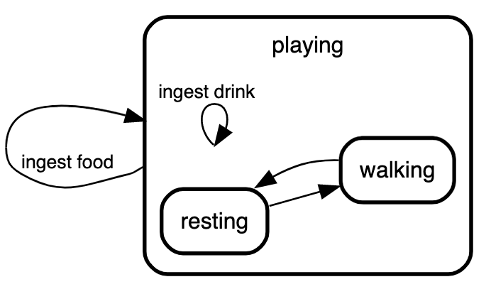
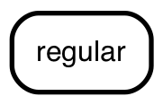
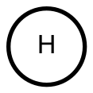
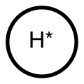
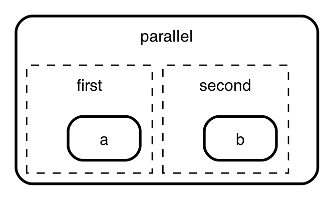
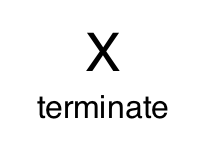

# State Machine cat

_write beautiful state charts_

[](https://github.com/sverweij/state-machine-cat/actions)
[](https://travis-ci.org/sverweij/state-machine-cat)
[](https://gitlab.com/sverweij/state-machine-cat/builds)
[](https://snyk.io/test/github/sverweij/state-machine-cat?targetFile=package.json)
[](https://codeclimate.com/github/sverweij/state-machine-cat/maintainability)
[](https://npmjs.com/package/state-machine-cat)
[](LICENSE)
[](https://state-machine-cat.js.org)

## What?

Makes this


from this

```smcat
initial,
doing: entry/ write unit test
       do/ write code
       exit/ ...,
# smcat recognizes initial
# and final states by name
# and renders them appropriately
final;

initial      => "on backlog" : item adds most value;
"on backlog" => doing        : working on it;
doing        => testing      : built & unit tested;
testing      => "on backlog" : test not ok;
testing      => final        : test ok;
```

## Why

To enable me to make state charts ...

- ... that look _good_
- ... with the least effort possible
- ... whithout having to interact with drag and drop tools. Entering text
  is fine, doing my own layout is not.
- ... without having to dive into GraphViz `dot` each time. GraphViz is cool,
  but is was not designed to write & maintain conceptual documents in
  (_You'll know what I'm talking about if you ever tried to get it to draw nested nodes. Or edges between those._ )

## Usage

### On line

A no-frills interpreter on line: [state-machine-cat.js.org](https://state-machine-cat.js.org).

### Within the Atom editor

There's an [Atom package](https://atom.io/packages/state-machine-cat-preview)
with syntax highlighting, a previewer and some export options. You can install
it from within Atom (search for _state machine cat_ in the _install_ section
of the settings screen) or use `apm i state-machine-cat-preview`
if you're a command line person.

OTOH. if you're a command line person the _command line interface_ might be
something for you too:

### Command line interface

Just `npm install --global state-machine-cat` and run `smcat`

This is what `smcat --help` would get you:

```
Usage: smcat [options] [infile]

 Write beautiful state charts - https://github.com/sverweij/state-machine-cat

Options:
  -V, --version               output the version number
  -T --output-type <type>     svg|eps|ps|ps2|dot|smcat|json|ast|scxml|oldsvg|scjson (default: "svg")
  -I --input-type <type>      smcat|json|scxml (default: "smcat")
  -E --engine <type>          dot|circo|fdp|neato|osage|twopi (default: "dot")
  -d --direction <dir>        top-down|bottom-top|left-right|right-left (default: "top-down")
  -o --output-to <file>       File to write to. use - for stdout.
  --dot-graph-attrs <string>  graph attributes to pass to the dot render engine
  --dot-node-attrs <string>   node attributes to pass to the dot render engine
  --dot-edge-attrs <string>   edge attributes to pass to the dot render engine
  --desugar                   transform pseudo states into transitions (!experimental!)
  -l --license                Display license and exit
  -h, --help                  display help for command
```

... so to convert the above chart to `sample.svg`

```sh
bin/smcat docs/sample.smcat
```

> <details>
>   <summary>note for use on Node.js 12 and up</summary>
>   On Node.js 12 (and up) you might see a warning message on stderr:
>   <code>Invalid asm.js: Function definition doesn't match use</code>.
>   It's harmless. See <a href="docs/faq.md#q-im-on-node-12-and-get-a-warning-when-i-convert-to-svg-with-the-cli-whats-up">the FAQ</a> for details.
> </details>

Or, if you'd rather have the native GraphViz dot do that for you:

```sh
bin/smcat -T dot docs/sample.smcat -o - | dot -T svg -odoc/sample.svg
```

Leaving the options at the default settings usually deliver the best
results already, so if they bewilder you: don't worry.

The `--dot-graph-attrs` (and the node and edge variants thereof) exist in case you want
to override default attributes in the generated picture; e.g. to get a transparent background
and draw edges as line segments instead of splines, use this:

```sh
bin/smcat --dot-graph-attrs "bgcolor=transparent splines=line" docs/sample.smcat
```

When you pass the `--desugar` (&tritime; experimental) switch, state-machine-cat will,
before rendering, transform some pseudo states into transitions - see
[de-sugaring state machines](docs/desugar.md) for details.

### State chart XML (SCXML)

_state machine cat_ can write **and read** valid core constructs
[scxml](https://www.w3.org/TR/scxml/) documents. If you're into that sort
of thing you can read all about it in [State Machine Cat and SCXML](./docs/SCXML.md).

### Programmatically

After you `npm i` 'd `state-machine-cat`:

```javascript
const smcat = require("state-machine-cat");

try {
  const lSVGInAString = smcat.render(
    `
            initial => backlog;
            backlog => doing;
            doing => test;
        `,
    {
      outputType: "svg",
    }
  );
  console.log(lSVGInAString);
} catch (pError) {
  console.error(pError);
}
```

Read more in [docs/api.md](docs/api.md)

## The language

### Short tutorial

#### simplest

```smcat
on => off;
```


- _smcat_ automatically declares the states. You _can_ explicitly declare
  them if you want them to have more than a name only - see _state
  declarations_ below.

#### labels

```smcat
on => off: switch;
```


UML prescribes to place _conditions_ after _events_, to place
_conditions_ within squares and to place _actions_
after a `/`: `from => to: event [conditions]/ actions`, e.g. `on => off: switch flicked [not an emergency]/ light off;`.

You're free to do so, but _smcat_ doesn't check for it. It internally takes
the notation into account, though and if you choose to export to json, scxml
or scjson you'll see them nicely split out.

```smcat
on => off: switch flicked/
           light off;
off => on: switch flicked/
           light on;
```


> You note that smcat rendered the states in this chart _top down_ instead of
> _left to right_. It did that because we told it so. You can do that too
> with `--direction` on the command line, or in atom by `direction -> left to right` or `direction -> top down` from the chart's submenu.

#### notes

```smcat
# this is a note
on => off;
```


#### state declarations

If you need to define activities (e.g. `entry` or `exit` triggers) on
a state, you can explicitly declare the state and put the activites
after a colon:

```smcat
# yep, notes get rendered here as well
# multiple notes translate into multiple
# lines in notes in the diagram
doing:
  entry/ make a feature branch
  exit/ deploy code on production
  ...;
```


_smcat_ recognizes the `entry/` and `exit/` keywords and treats
everything after it on the same line to be the 'body' of the
trigger.

Here too: you're free to use them, but you don't _have_ to.
_smcat_ takes them into account in its internal representation
and uses them in exports to json, scxml and scjson.

#### state display names

If you want to use a display names that differ from how you
name the states (e.g. if the display names are long),
you can do so by adding a label to them:

```smcat
on [label="Lamp aan"],
off [label="Lamp uit"];

off => on: on pushed;
on => off: off pushed;
```


#### `initial` and `final`

When `initial` or `final`, is part of a state's name _smcat_ treats
it as the UML 'pseudo states' `initial` and `final` respectively:

```smcat
initial => todo;
todo    => doing;
doing   => done;
done    => final;
```


#### `history`

_smcat_ recognizes states with `history` in their name as history states:

```smcat
initial,
"power off",
running {
  running.history;

  washing -> rinsing: 20 min;
  rinsing -> spinning: 20 min;
  spinning -> final: 20 min;
},
final;

initial => washing;
running => "power off": power out;
"power off" => running.history: restore power;
```


History states are _shallow_ by default. If you want a history state to
be _deep_ just put that somewhere in the name (e.g. `"running deep history"`
or `running.history.deep`) - and smcat will render them as such.

#### Choice - `^`

_smcat_ treats states starting with `^` as UML pseudo state _choice_. Strictly
speaking 'choice' is a superfluous element of the UML state machine
specification, but it is there and sometimes it makes diagrams easier to read.

```smcat
^fraud?: transaction fraudulent?;

initial -> reserved;
reserved -> quoted:
    quote
    requested;
quoted -> ^fraud?: payment;
^fraud? -> ticketed: [no];
^fraud? -> removed: [yes];
ticketed -> final;
removed -> final;
```


#### Forks, joins and junctions - `]`

In UML you can fork state transitions into multiple or join them into one
with the _fork_ (one to many) _join_ (many to one) and _junction_ (many to many)
pseudo states. _Fork_ and _join_ are represented by a black bar, _junction_
by a filled circle.
To make a _join_, _fork_ or _junction_ pseudo state, start its
name with a `]`.
Here's an example of a _join_:

```smcat
a => ]join;
b => ]join;
]join => c;
```


> State machine cat automatically derives which of the three types
> you meant by counting the number of incoming and the number of
> outgoing connections:
>
> - one incoming and multiple outgoing: it's a _fork_
> - multiple incoming and one outgoing: it's a _join_
> - all other cases: it's a _junction_
>
> If you want to defy UML semantics you can do that with
> [explicit type overrides](#overriding-the-type-of-a-state) .

```smcat
a => ]junction;
b => ]junction;
]junction => c;
]junction => d;
```


#### Terminate

UML has a special pseudo state to indicate your state machine didn't
exit properly: _terminate_. If you want to use it, declare it
explicitly:

```smcat
Aahnohd [type=terminate label="Terminated"];

a => Aahnohd: [hit by meteorite];
```


> For proper exits you'd typically use the _final_ state.

#### Gotchas

- when you need `;`, `,`, `{`, `[` or spaces as part of a state - place em in quotes
  `"a state"`
- Activities have the same restriction, except they allow spaces.
- Labels have the same restriction as activities, except they allow for `,` too.
- State declaration precedence is: deep wins from shallow; explicit wins from
  implicit
- It's possible to declare the same state multiple times on the same level, buts
  smcat will take the last declaration into account only. For example:

This

```
# first declaration of "cool state"
"cool state",
"other state",
# second declaration of "cool state"
"cool state": cool down;
```

results in (/ is equivalent to):

```
# second declaration of "cool state"
"cool state": cool down,
"other state";
```

#### nested state machines

It's possible to have state machines _within_ states.
the states _stopped_, _playing_ and _pause_ can only occur when
the tape player is on:

```
initial,
"tape player off",
"tape player on" {
  stopped => playing : play;
  playing => stopped : stop;
  playing => paused  : pause;
  paused  => playing : pause;
  paused  => stopped : stop;
};

initial           => "tape player off";
"tape player off" => stopped           : power;
"tape player on"  => "tape player off" : power;
```


#### parallel states

If stuff is happening in parallel within a state you can express
that too. Just make sure the state has the word "parallel" in there:

```smcat
initial,
bla.parallel {
    first{
        first.thing -> first.thang;
    },
    second{
        second.thing -> second.thang;
        second.thang -> second.thing;
    };
},
final;

initial -> ]split;
]split  -> first.thing;
]split  -> second.thing;
first.thang  -> ]merge;
second.thang -> ]merge;
]merge  -> final;
```


#### `internal` and `external` transitions

If you need to mark a transition in a nested state machine as either _internal_
or _external_ - use the `type` attribute. The default type for a transition
is `external` - just like it is in SCXML.

```smcat
playing {
  resting => walking;
  walking => resting;

};

playing => playing: ingest food;
playing => playing [type=internal]: ingest drink;
```



#### marking states _active_

You can mark one or more states as active by adding `active` as an
attribute for that state. E.g. to make the `do` state an active one
in the demming circle, do this:

```smcat
do [active];

initial -> plan;
plan    -> do;
do      -> study;
study   -> act;
act     -> plan;
```

which will result in


#### colors

As of version 4.2.0 state-machine-cat has (experimental) support for colors on both
states and transitions.

For example, this ...

```smcat
eat   [color="#008800"],
sleep [color="blue" active],
meow  [color="red"],
play  [color="purple"];

sleep -> meow  [color="red"]    : wake up;
meow  -> meow  [color="red"]    : no response from human;
meow  -> eat   [color="#008800"]: human gives food;
meow  -> play  [color="purple"] : human gives toy;
play  -> sleep [color="blue"]   : tired or bored;
eat   -> sleep [color="blue"]   : belly full;
```

... would yield this diagram:


What does 'experimental' mean?

> The color attribute is probably here to stay.
>
> However, I haven't found the balance between ease of use
> and expressiveness yet. Should the text in a state be rendered in the same color?
> should the background color automatically be rendered as well? In the same color,
> or in a shade smartly derived? Or should I include a bunch of color attributes
> (e.g. fillcolor, textcolor, textbgcolor) for ultimate control?

#### classes

As of version 7.4.0 you can use the keyword `class` as an extended keyword on
both states and transitions. When you render `svg` or `dot` you'll see what you
entered there in the output in the `class` attributes of their respective
elements, along with the type of element (either 'state' or 'transition') and
optionally the type of state or transtion (e.g. for state: 'initial', 'regular',
'final' etc.).

For example, this ...

```smcat
a [class="dismissed"],
b [class="y"];

a => b [class="a bunch of classes"];
```

... will yield this 'dot' program ...

```graphviz
digraph "state transitions" {
  fontname="Helvetica" fontsize=12 penwidth=2.0 splines=true ordering=out compound=true overlap=scale nodesep=0.3 ranksep=0.1
  node [shape=plaintext style=filled fillcolor="#FFFFFF01" fontname=Helvetica fontsize=12 penwidth=2.0]
  edge [fontname=Helvetica fontsize=10]

    "a" [margin=0 class="state regular dismissed" label= <
      <table align="center" cellborder="0" border="2" style="rounded" width="48">
        <tr><td width="48" cellpadding="7">a</td></tr>
      </table>
    >]
    "b" [margin=0 class="state regular y" label= <
      <table align="center" cellborder="0" border="2" style="rounded" width="48">
        <tr><td width="48" cellpadding="7">b</td></tr>
      </table>
    >]

    "a" -> "b" [label=" " class="transition a bunch of classes"]
}
```



Which will pass the class attributes on to the svg like so. E.g. the svg snippet
for the `a` state will look like this:

```svg
<!-- ... -->
  <g id="node1" class="node state regular dismissed">
    <title>a</title>
    <polygon fill="#ffffff" fill-opacity="0.003922" stroke="transparent" stroke-width="2" points="56,-100 0,-100 0,-64 56,-64 56,-100"></polygon>
    <text text-anchor="start" x="24.6646" y="-78.2" font-family="Helvetica,sans-Serif" font-size="12.00" fill="#000000">a</text>
    <path fill="none" stroke="#000000" stroke-width="2" d="M12.3333,-65C12.3333,-65 43.6667,-65 43.6667,-65 49.3333,-65 55,-70.6667 55,-76.3333 55,-76.3333 55,-87.6667 55,-87.6667 55,-93.3333 49.3333,-99 43.6667,-99 43.6667,-99 12.3333,-99 12.3333,-99 6.6667,-99 1,-93.3333 1,-87.6667 1,-87.6667 1,-76.3333 1,-76.3333 1,-70.6667 6.6667,-65 12.3333,-65"></path>
  </g>
<!-- ... -->
```

#### Gotchas

- You will have to provide the style sheet defining the classes yourself in the
  context where you render the svg in order for them to actually show up
- The characters you can use for class names is limited to alpha-numerics, dashes,
  underscores - and spaces to separate them. This to make it harder to use
  state-machine-cat to construct svg's that are either invalid or malicious. The
  limited character set is in contrast to what css allows, which is
  [everything under the sun and then some](https://mathiasbynens.be/notes/css-escapes) -
  but it seems like a reasonable compromise.

### overriding the type of a state

As you read above, _state machine cat_ derives the type of a state from its name.
In some cases that might not be what you want. In those cases, you can
override the type with the `type` attribute, like in this example for the
`initialized` state.

```smcat
initial,
starting,
initialized [color="red" type=regular],
running,
final;

initial     => starting;
starting    => initialized;
initialized => running;
initialized => stopped;
running     => stopped;
stopped     => final;
```


The values you can use for the `type` of a state:

| type          | example                                                                              |
| ------------- | ------------------------------------------------------------------------------------ |
| `regular`     |            |
| `initial`     |            |
| `final`       |                |
| `history`     |            |
| `deephistory` |  |
| `choice`      |             |
| `fork`        |                  |
| `join`        |                  |
| `forkjoin`    |          |
| `junction`    |          |
| `parallel`    |         |
| `terminate`   |       |

#### grammar

I made the parser with pegjs - you can find it at
[src/parse/peg/smcat-parser.pegjs](src/parse/smcat/peg/smcat-parser.pegjs)

## Status

- Thoroughly tested and good enough for public use.
- Despite this you might bump into the occasional issue - don't hesitate to
  report it, either on [GitLab](https://gitlab.com/sverweij/state-machine-cat/issues)
  or on [GitHub](https://github.com/sverweij/state-machine-cat/issues).
- Runs on latest versions of firefox, safari and chrome and node versions >= 10.
  Although it might run on other environments, it's not tested there. I will
  reject issues on these other environments, unless they're accompanied with
  sufficient enticement to make it worth my while.


