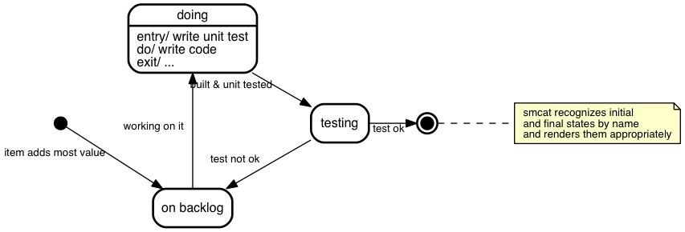
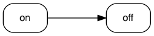
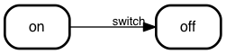
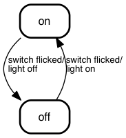
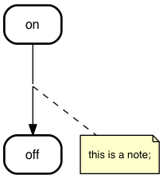
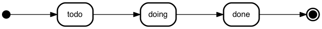
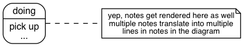
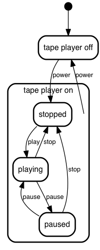

# State-Genny
*Turns text into state charts*

## What?
Makes this



from this
```stategenny
initial,
doing: entry/ write unit test
       do/ write code
       exit/ ...,
# stategenny recognizes initial
# and final states by name
# and renders them appropriately
final;

initial      => "on backlog" : item adds most value;
"on backlog" => doing        : working on it;
doing        => testing      : built & unit tested;
testing      => "on backlog" : test not ok;
testing      => final        : test ok;
```

## Why
To enable me to make state charts ...
- ... that look _good_
- ... with the least effort possible
- ... whithout having to interact with drag and drop tools. Entering text
  is fine, doing my own layout is not.
- ... without having to dive into GraphViz `dot` each time. GraphViz is cool,
  but is was not designed to write & maintain conceptual documents in
  (_You'll know what I'm talking about if you ever tried to get it to draw nested nodes. Or edges between those._ )

## Usage

### Command line interface
`bin/stategenny`

```
Usage: stategenny [options] [infile]

Options:

  -h, --help               output usage information
  -V, --version            output the version number
  -T --output-type <type>  stategenny|dot|json|ast|svg. Default: svg
  -I --input-type <type>   stategenny|json. Default: stategenny
  -i --input-from <file>   File to read from. use - for stdin.
  -o --output-to <file>    File to write to. use - for stdout.
  -l --license             Display license and exit
```

... so to convert the above chart to `sample.svg`

```sh
bin/stategenny -T svg doc/sample.stategenny
```

Or, if you'd rather have the native GraphViz dot do that for you:

```sh
bin/stategenny -T dot doc/sample.stategenny -o - | dot -T svg -odoc/sample.svg
```

### Programmatically

```javascript
const stategen = require("./path/to/stategenny");

stategen.render(
    `
        initial => backlog;
        backlog => doing;
        doing => test;
    `,
    {
        outputType: "svg"
    },
    (pErrror, pSuccess) => console.log(pError || pSuccess)
);
```

## The language

### Short tutorial

#### simplest
```stategenny
on => off;
```


- _stategenny_ automatically declares the states. You _can_ explicitly declare
  them if you want them to have more than a name only - see _explicit state
  declarations_ below.

#### labels
```stategenny
on => off: switch;
```


UML prescribes to place _conditions_ after _events_, to place
_conditions_ within squares and to place actions
after a `/`: `on => off: switch flicked [not an emergency]/ light off;`.

You're free to do so, but _stategenny_ doesn't check for it. It might take
the notation into account somewhere in the future (although I see no reason
to make it mandatory).
```stategenny
on => off: switch flicked/
           light off;
off => on: switch flicked/
           light on;
```


#### notes
```stategenny
# this is a note
on => off;
```



#### `initial` and `final`
When you name a state `initial` or `final`, _stategenny_ treats them as
the UML 'pseudo states' for inital and final:
```stategenny
initial => todo;
todo    => doing;
doing   => done;
done    => final;
```


#### explicit state declarations
```stategenny
# yep, notes get rendered here as well
# multiple notes translate into multiple
# lines in notes in the diagram
doing: pick up
       ...;
```


#### Gotchas
- when you need `;`, `,`, `{` or spaces as part of a state - place em in quotes
    `"a state"`
- Activities have the same restriction, except they allow spaces.
- Labels have the same restriction as activities, except they allow for `,` too.
- State declaration precedence is: deep wins from shallow;
  explicit wins from implicit (TODO: point to a list of examples that expose
  the behavior)
- It's possible to declare the same state multiple times on the same level, buts
  Stategenny will take the last declaration into account only. For example:

This
```
# first declaration of "cool state"
"cool state",
"other state",
# second declaration of "cool state"
"cool state": cool down;
```
results in (/ is equivalent to):
```
# second declaration of "cool state"
"cool state": cool down,
"other state";
```


#### nested states
It's possible to group states into composite states. In this example
the
```
initial,
"tape player off",
"tape player on" {
  stopped, playing, paused;

  stopped => playing : play;
  playing => stopped : stop;
  playing => paused  : pause;
  paused  => playing : pause;
  paused  => stopped : stop;
};

initial           => "tape player off";
"tape player off" => stopped           : power;
"tape player on"  => "tape player off" : power;

```


#### orthogonal states (not implemented yet)
```
orthogonal {
    aan => uit;
    ---
    on => off;
}
```

#### grammar
I made the parser with pegjs - you can find it at
[src/parse/peg/stategenny-parser.pegjs](src/parse/peg/stategenny-parser.pegjs)


## Status
- It's working and tested.
- It's 0.1.0; which means there's things I want to do to make
  it pleasant to use before releasing it:

### TODO
- Short term
  - [x] Language: add `--` as a valid forward arrow
  - [x] Language: unit tests for rainy day scenarios (goal: ~80% parser coverage - not 90 or 100 because there's boilerplate code in the parser, which was generated from a peg (and hence is quite reliable anyway))
  - [x] unit tests for rendering
  - [x] unit tests for the CLI
  - [x] test coverage > 90%
  - [x] render with a javascript/ web native library
  - [x] cook an on line interpreter with that
  - [x] document the language
  - [ ] find a name for which `daftnessIndex(name) < daftnessIndex('stategenny')`
      - maquina
      - statula/ graph statula (sounds like that thing your GP stuck in your mouth when he wanted to check your throat)
      - ~~~macula~~~ (looks like a cool wordplay, but it's Latin for 'spot')
      - Machine Genny (=> fun fact: the Jenny Machine exists; an advanced spinning wheel from the looks of it)
      - machenny (=> MacHenny :-/)
      - ~~~fsmgen~~~ (taken)
      - FSM Genny/ FS Genny/ SM Genny
      - ~~~MsGenny's SM shop~~~
      - ~~~statu~~~ (google translate 'state machine' in Latin)
      - apparatus (google translate 'machine' in Latin)
      - ~~~eindigetoestandsautomaat~~~
      - ~~~machine à états finis~~~
      - Final State (=> also a band name (?))
      - DFA (Deterministic Finite Automaton)
- Middle long term
  - [ ]  publish to npm
  - [x]  ~~~add auto-wrap for (at least) notes~~~
  - [x]  add support for nested states
  - [ ]  add support for orthogonal states
  - [ ]  find an alternative for graph rendering - viz.js works quite well,
         but it's also a 3.5Mb tank that is not very suitable for serious
         online use.
- Long term
  - [x] create an atom package with
      - [x] syntax highlighting
      - [x] previewer (à la atom-mscgen-preview)
  - [ ] create an embedsel lib
  - [ ] parse the _activities_ (state) and _label_ into meaningful attributes
    (activity, condition, action, ... => see the UML standard)

### Flare section
[](https://gitlab.com/sverweij/state-genny/builds)
[](https://gitlab.com/sverweij/state-genny/builds)
