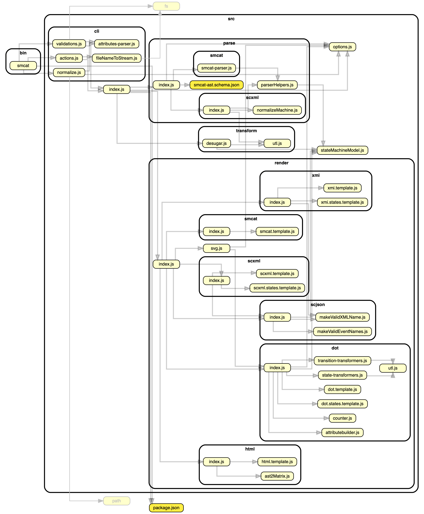

### What's in here

This folder currently has a mixed purpose:

- Home for the documentation
- The source for the root of _state machine cat_'s on line version that's available on https://state-machine-cat.js.org
  (and [on gitlab.io](https://sverweij.gitlab.io/state-machine-cat)). This is because `docs`
  is the folder github uses as the root of any github pages page (which powers
  state-machine-cat.js.org).

### Dependency graph

Click on the image for a slightly more interactive version that (a.o.) navigates you
to a source file when you click on it. The graph omits any external dependencies to
remain concise.

(Generated with [dependency-cruiser](https://github.com/sverweij/dependency-cruiser))
