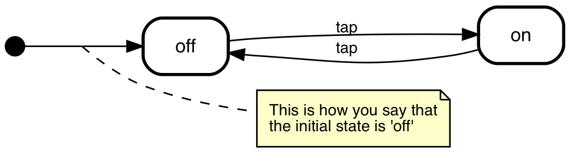

# State Machine Cat and SCXML

State Chart XML is a [w3c recommendation](https://www.w3.org/TR/scxml/) that
aims to be a generic state-machine based execution environment. The 
[core constructs](https://www.w3.org/TR/scxml/#Basic) part of it provides a
standard way to describe state charts. _State machine cat_ can output 
core constructs SCXML. It looks like this:

```xml
<?xml version="1.0" encoding="UTF-8"?>
<scxml xmlns="http://www.w3.org/2005/07/scxml" initial="meow" version="1.0">
    <state id="eat">
        <transition event="belly full" target="sleep"/>
    </state>
    <state id="sleep">
        <transition event="wake up" target="meow"/>
    </state>
    <state id="meow">
        <transition event="no response from human" target="meow"/>
        <transition event="human gives food" target="eat"/>
        <transition event="human gives toy" target="play"/>
    </state>
    <state id="play">
        <transition event="tired or bored" target="sleep"/>
    </state>
</scxml>
```

## Usage
Both the command line and the online interpreter support scxml output.
- Command line: `smcat --output-type scxml mycoolchart.smcat` 
- Online interpreter: pick _SCXML_ from the hamburger menu.

## What is supported?
All core constructs, except _transitions_ without a _target_, which are
not a concept in _state machine cat_'s language.

Also, _state machine cat_'s primary goal is to _visualize_ state machines.
With that in mind it will focus on the core constructs and not on 
other parts of the SCXML w3c recommendation (like executable content,
data model, external communications).

## What more do I need to know?
I've made some choices how to convert state machine cat/ UML
constructs to SCXML that seemed logical to me. Which means
they might surprise you.

### _initial_ (pseudo) states
In UML _initial_ pseudo state is not the real initial state.
_The initial state is the one the pseudo state *points to*_. 



SCXML lives by this realization as well. It does support the
_initial_ pseudo state, but it also has an `initial` attribute in both
the top (scxml node) level and at the state level. _state machine cat_
usually transforms initial states into those attributes. E.g. the
above state machine would look like this:

```xml
<?xml version="1.0" encoding="UTF-8"?>
<scxml xmlns="http://www.w3.org/2005/07/scxml" initial="off" version="1.0">
    <state id="off">
        <transition event="tap" target="on"/>
    </state>
    <state id="on">
        <transition event="tap" target="off"/>
    </state>
</scxml>
```

The only reason to still have an `<initial>` pseudo state in an
scxml document is to express that when you go into the real initial
state for the very first time, you want an _action_ to happen.

Hence, if _state machine cat_ sees an _action_ on a transition from an
initial pseudo state to the real initial state, it'll put an
initial pseudo state in the output. 

```smcat
initial => off: /regurgitate the brimstone;
```

```xml
<scxml xmlns="http://www.w3.org/2005/07/scxml" initial="initial" version="1.0">
    <initial id="initial">
        <transition target="off" action="regurgitate the brimstone">
    </initial>
    <state id="off">
    </state>
</scxml>
```

### _initial_: the Highlander rule
_There can be only one_ initial state per _state machine_, and each
initial pseudo state can only have one transition out. This means
there's at most one _initial_ state on scxml level, and at most one
initial state for each composite state.

State machine cat (currently) does not enforce this rule,
so it has to choose. If there's more than one initial state, or more
than one transition out of an initial state it picks the first
one it encounters.

### Events on states
smcat recognizes the entry/ and exit/ keywords and treats everything
after it on the same line to be the 'body' of the trigger.

So this

```smcat
landing:
  entry/ cabin crew take your seat
  entry/ cabin crew arm the slides
  exit/ cabin crew disarm the slides
;
```

translates into

```xml
<?xml version="1.0" encoding="UTF-8"?>
<scxml xmlns="http://www.w3.org/2005/07/scxml" version="1.0">
    <state id="landing">
        <onentry>cabin crew take your seat</onentry>
        <onentry>cabin crew arm the slides</onentry>
        <onexit>cabin crew disarm the slides</onexit>
    </state>
</scxml>
```

### _fork_, _join_ and _junction_ pseudo states
At the moment _state machine cat_ makes these into full fledged
SCXML states. This is not incorrect, but [de-sugaring](./desugar.md)
might be a better approach. I've kept that as a future feature
for now.

### Events on transitions
If you use the UML way of writing events on transitions, like so:

```smcat
a => b: event [condition] / action
```

_state machine cat_ extracts the correct events and emits
them into SCXML

```xml
<state id="a">
    <transition target="b" event="event" cond="condition">
        action
    </transition>
</state>
```

### Transforming state names to valid XML id's
State id's in SCXML have constraints the smcat language does not have.
_state-machine-cat_ transforms state name to conform to these
constraints. It uses these rules:
- If the state name is a valid XML id already it leaves it as is.
- Replace all invalid state name characters with `_`'s
- If the state name starts with a character that (1) is valid in
  an XML id, but (2) not as a start character it puts a `_` in front of it.
- If the state has no name or an empty name: use `__empty` as a name.

state name          | valid XML ID
---                 | ---
`On`                | `On`
`"media player on"` | `media_player_on`
`"8 ball shaking"`  | `_8_ball_shaking`
`""`                | `__empty`

One of the consequences of this transformation algorithm is that in
edge cases it's possible to get unintended name clashes. E.g. when
you have a "yes|no" and a "yes no" state, they'll both map to "yes_no".

Especially with sparsely named pseudo states this might spell trouble; 
a choice state named `^` and a fork state named `]` will both map to
`_`. The obvious way to prevent this is to name the choices/ forks/ joins.
It'll make your smcat source more readable in the process:
```smcat
^cool? -> "tell @sverweij": no;
^cool? -> "star state-machine-cat on github": yes;
```

#### References
- The [state part](https://www.w3.org/TR/scxml/#state) of the SCXML 
specification, which points to
- the [ID paragraph](https://www.w3.org/TR/xmlschema-2/#ID) in the 
xmlschema specification, which points to
- the [ID attribute validity constraint](https://www.w3.org/TR/xml/#id)
in the xml spec, which points to
- the [Name production rule](https://www.w3.org/TR/xml/#NT-Name) in
that same spec.

## Why?
The SCXML specification seemed useful. The only way (for me) to grasp
a specification is to use it. Writing an SCXML renderer for state
machine cat fit the bill.

This has had two side effects:
- State machine cat models are now a little more 
  interoperable with the rest of the world.
- I realized state machine cat could be expanded with some
  useful concepts:
  - history states (implemented in v2.3.0, _deep_ history in v2.6.0)
  - initial and final states within composite states (implemented
    in v2.3.0)
  - separate `event [condition]/ action` in the internal models
    (implemented in v2.3.0)
  - the `scjson` format - which is conceptually equal to scxml but
    in javascript is lot easier to read from and translate into
    (implemented in v2.3.0)
  - _onentry_, and _onexit_ events on states (implemented in v2.4.0)
  - _parallel states_ (implemented in v2.5.0)
  - model rules (e.g. one initial per state machine, only actions on initial pseudo to the real initial, ... - future feature)
  - [de-sugaring pseudo states](./desugar.md) into core constructs (future feature)
  
