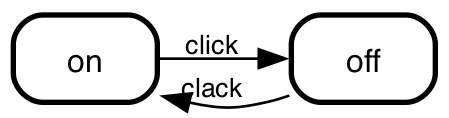

# State machine cat - API

If you want to integrate state-machine-cat in your own application in some way,
there is an API. If you're looking into samples of how to use it: the
[command line](../src/cli),
[website](https://state-machine-cat.js.org) and
[atom package](https://atom.io/packages/state-machine-cat-preview) already do.

> Make sure that if you integrate state-machine-cat into your software, your
> software respects state-machine-cat's license ([The MIT License](../LICENSE))

## Basic use

```javascript
const smcat = require("state-machine-cat");

try {
    const lSVGInAString = smcat.render(
        `
            on => off: click;
            off => on: clack;
        `,
        {
            outputType: "svg",
            direction: "left-right"
        }
    );
    console.log(lSVGInAString);
} catch (pError) {
    console.error(pError);
}
```

> In version 1 and 2 you can also use a callback, however
> this is _deprecated_ - it will be removed in the next major
> release.

Both will dump an svg picture on stdout, which would look like this:



## Public API
### `render (script, options, callback)`
The main render function. It parses and renders the _smcat_ `script` you pass
it, talking any `options` into account and calling `callback` with the results.

#### `script`
A string containing the script you want to get rendered. This is typically in
the _smcat_ language (see the
[readme](../README.md)
for details), but you if you pass "json" to the `inputType` option, `render`
will expect an abstract syntax tree of a state machine.

#### `callback`
A function. When `render` is done it will call this
function with two parameters:
- the first will contain `null` if render completed successfully, and an
  `Error` object in all other cases.
- The second parameter contains the result of the rendition if the render
  completed successfully (and `undefined` in all other cases.)

#### `options`
An object, with attributes to steer the behaviour of the render function. You
can get the actual list of the options you can pass, their allowed values
and the defaults you'd get when you don't specify them from the
`smcat.getAllowedValues()` function below, so you don't have to hard
code the parameters or the values you can pass them.

At the time of writing the API does _no validation_ on the values of these
options. Instead it expects the caller to sanitize and validate them before
calling it. The `smcat.getAllowedValues()` will simplify that, but despite
this I'm thinking of moving the validations behind the API anyway somewhere
in the future.

##### `options.inputType`
How to interpret the `script` parameter. Defaults to `smcat` - which means
`render` will expect `script` to be in the _smcat_ language.

Allowed values: call `smcat.getAllowedValues().inputType.values`

##### `options.outputType`
The type of output to emit when parsing and rendering was successful. Defaults
to "svg".

Allowed values: call `smcat.getAllowedValues().outputType.values`

##### `options.direction`
The direction to render the states in. Only makes sense when the output is a
graph, so it only works for outputTypes `dot` and `svg`.

Here's what `top-down` and `left-right` would be doing to the simple sample in
_basic use_ above:


##### `options.engine`
The GraphViz engine to use to convert `dot` to `svg`. This defaults to `dot`
which in the vast majority of cases will yield the best results.

Allowed values: call `smcat.getAllowedValues().engine.values`

### `smcat.getAllowedValues()`
Returns an object with all the possible options, and for each option the default
and an array of possible values. It'll typically look like this:

```javascript
{
    inputType: {
        default: "smcat",
        values: [
            {name: "smcat"},
            {name: "json"}
        ]
    },
    outputType: {
        default: "svg",
        values: [
            {name: "smcat"},
            {name: "dot"},
            {name: "json"},
            {name: "ast"},
            {name: "svg"},
            {name: "html"}
        ]
    },
    engine: {
        default: "dot",
        values: [
            {name: "dot"},
            {name: "circo"},
            {name: "fdp"},
            {name: "neato"},
            {name: "osage"},
            {name: "twopi"}
        ]
    },
    direction: {
        default: "top-down",
        values: [
            {name: "top-down"},
            {name: "left-right"}
        ]
    }
}
```

### `smcat.version`
The current version of the state-machine-cat package as a
[semver](https://semver.org) compliant string.
