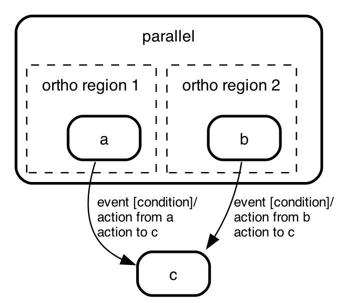
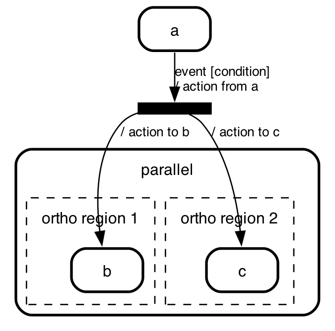
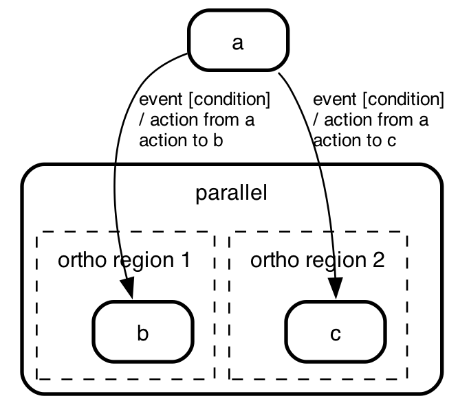
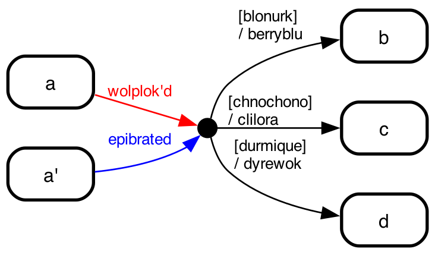

# De-sugaring state machines

State machine cat supports the _choice_, _fork_, _join_ and _junction_
pseudo states from the UML state chart specification. They
make some state charts more readable, but in themselves
don't add to the expressive power of state charts. Each
of these pseudo elements can be expressed in _states_
and _transitions_.

## De-sugaring _join_

A _join_ is a pseudo-state that joins two or more parallel
_transitions_ into one.

 => 

## De-sugaring _fork_

A _fork_ is a pseudo-state that forks a _transition_ into
more than one.

 => 

## De-sugaring _forkjoins_ ("_junctions_")

 => 

## De-sugaring _choice_

 => 

## Algorithm

- make a transition between each incoming state to each outgoing state
- in that transition put a label with `[${choicelabel} ${outgoingTransitionLabel}]`
- remove the choice state and all its incoming and outgoing transitions

definitions:

- incoming transition: a transition of which this choice is the 'to' state
- incoming state: the 'from' state of an incoming transition
- outgoing transition: a transition of which this choice is the 'from' state
- outgoing state: the 'to' state of an outgoing transition

## The semantics of _initial_

The _initial_ pseudo state is actually a trick to show what
the _actual_ initial state is.

