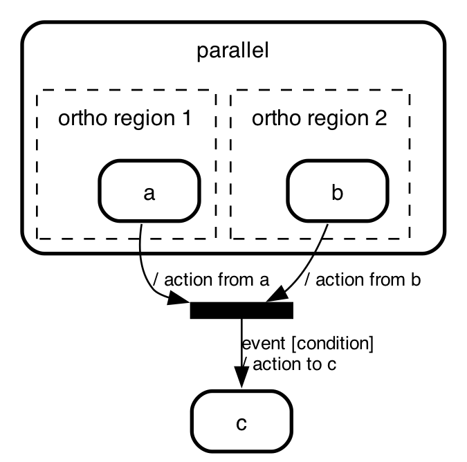
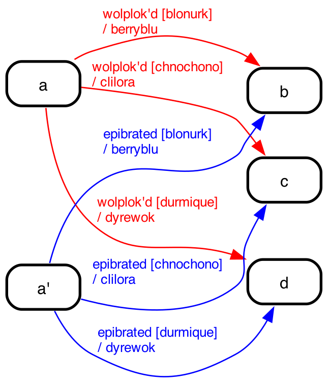
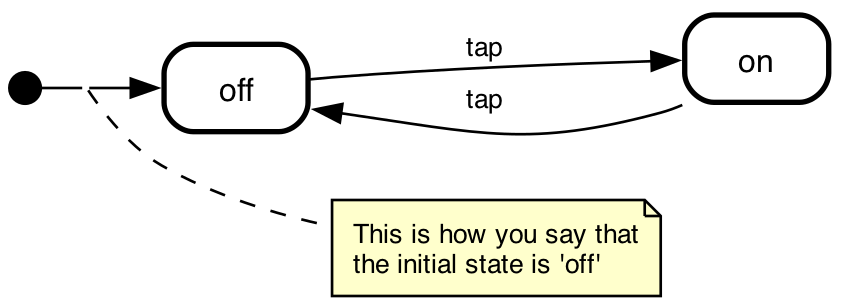

# De-sugaring state machines

State machine cat supports the _choice_, _fork_, _join_ and _junction_
pseudo states from the UML state chart specification. They
make some state charts more readable, but in themselves
don't add to the expressive power of state charts. Each
of these pseudo elements can be expressed in _states_
and _transitions_.

> As from version 5.2.0 state-machine-cat's command line interface,
> api and website have a switch for de-sugaring _fork_, _junction_ and
> _choice_ pseudo states as described below.
>
> - Command line: pass the `--desugar` flag
> - state-machine-cat.js.org: flick the `desugar (experimental!)` switch to _on_
> - API: pass the desugar flag (`{desugar: true}`)
>
> The feature is experimental, which means the feature can get a breaking
> change without state-machine-cat getting a major bump.

## De-sugaring _joins_, _forks_ and _junctions_

The de-sugaring consists of

- connecting all states that transition into that pseudo state
  to all states the pseudo state transitions into one transition
- combining any _events_, _conditions_ and _actions_ that exist on
  the incoming and outgoing transtions of the pseudo state.
  Combining is straightforward when the attribute is only on the
  incoming or only on the outgoing transition. When they're defined
  on both, though we need conflict resolution (for samples - see
  below):
  - for _events_ and _conditions_ the one on the outgoing transition
    wins. Typically _events_ and _conditions_ are allowed on one
    side of a pseudo state only (see below), so this should work out
    just fine for all situations.
  - _actions_ are allowed on most sides of pseudo states, so these
    get combined - in the order incoming action > outgoing action.

## De-sugaring _join_

A _join_ is a pseudo-state that joins two or more parallel
_transitions_ into one. It also waits until all incoming
transitions are done.

> **join** – This type of Pseudostate serves as a common target Vertex for two or more
> Transitions originating from Vertices in different orthogonal Regions. _Transitions
> terminating on a join Pseudostate cannot have a guard or a trigger_. Similar to
> junction points in Petri nets, join Pseudostates perform a synchronization function,
> whereby all incoming Transitions have to complete before execution can continue
> through an outgoing Transition.
>
> --- [OMG Unified Modeling Language (OMG UML) Version 2.5.1 - p 315](https://www.omg.org/spec/UML/2.5.1/PDF)

This means that it's not possible to replace a _join_ pseudo state with
its incoming and outgoing transitions without losing information. When state-machine-cat
desugars, it will leave _join_ states alone. In the future this behavior might
become overrideable. When implemented the desugaring would look like this:

 => 

## De-sugaring _fork_

A _fork_ is a pseudo-state that forks a _transition_ into
more than one parallel ones.

> **fork** – fork Pseudostates serve to split an incoming Transition into two
> or more Transitions terminating on Vertices in orthogonal Regions of a
> composite State. _The Transitions outgoing from a fork Pseudostate cannot
> have a guard or a trigger._
>
> --- [OMG Unified Modeling Language (OMG UML) Version 2.5.1 - p 315](https://www.omg.org/spec/UML/2.5.1/PDF)

 => 

## De-sugaring _junctions_

A _junction_ is a pseudo-state that (typically) connects multiple states with multiple other states.

> **junction** – This type of Pseudostate is used to connect multiple
> Transitions into compound paths between States. For example, a junction
> Pseudostate can be used to merge multiple incoming Transitions into
> a single outgoing Transition representing a shared continuation path.
> Or, it can be used to split an incoming Transition into multiple
> outgoing Transition segments with different guard Constraints.
>
> --- [OMG Unified Modeling Language (OMG UML) Version 2.5.1 - p 315](https://www.omg.org/spec/UML/2.5.1/PDF)

 => 

## De-sugaring _choice_

> **choice** – This type of Pseudostate is similar to a junction
> Pseudostate (see above) and serves similar purposes, with the
> difference that the guard Constraints on all outgoing Transitions
> are evaluated dynamically, when the compound transition traversal
> reaches this Pseudostate. Consequently, choice is used to realize
> a dynamic conditional branch. It allows splitting of compound
> transitions into multiple alternative paths such that the decision
> on which path to take may depend on the results of Behavior executions
> performed in the same compound transition prior to reaching the choice
> point. If more than one guard evaluates to true, one of the
> corresponding Transitions is selected. The algorithm for making this
> selection is not defined. If none of the guards evaluates to true, then
> the model is considered ill formed. To avoid this, it is recommended to
> define one outgoing Transition with the predefined “else” guard for
> every choice Pseudostate.
>
> --- [OMG Unified Modeling Language (OMG UML) Version 2.5.1 - p 315](https://www.omg.org/spec/UML/2.5.1/PDF)

 => 

## The semantics of _initial_

The _initial_ pseudo state is actually a trick to show what
the _actual_ initial state is.

