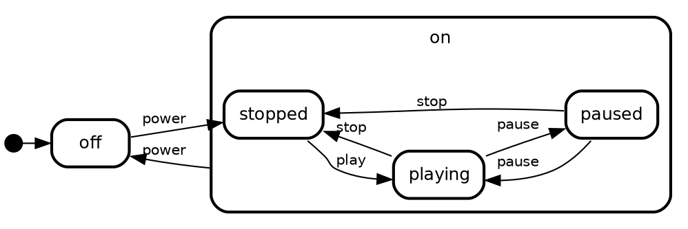
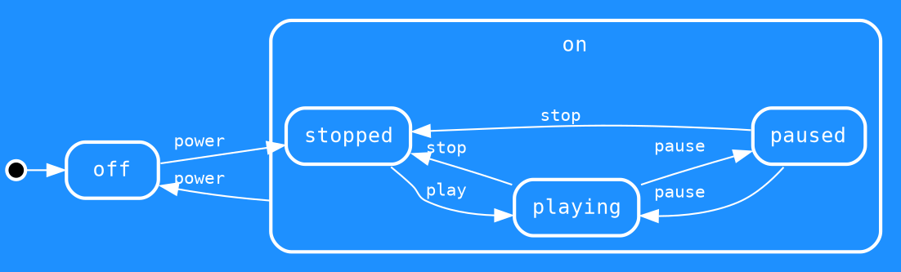

## Styling state machine graphics

Under the hood state-machine-cat uses GraphViz dot. It's possible to manually tweak and/ or post-process the dot it generates. However, state-machine-cat has some ways to pass styling attributes to GraphViz, which might be an easier option.

> state-machine-cat passes the styling attributes directly to GraphViz. This means you
> can use everything documented on the GraphViz website under [Node, Edge and Graph Attributes](https://graphviz.gitlab.io/_pages/doc/info/attrs.html), but also that it doesn't
> validate what it passes.
>
> If you're not familiar with GraphViz - there's a small appendix below that runs
> throught the basics as relevant for use within state-machine-cat. For detailed
> documentation you're best off checking [graphviz.org](https://graphviz.org)

Below we'll use the state machine of a cassette player, which we want to give a slightly more 'engineering look'; a blue background, white lines and a mono spaced font. Without any modifications it'd look like this:


After we're done it'll look closer to this:


<details>
<summary>source</summary>

```smcat
initial,
off,

on {
  stopped, playing, paused;

  stopped => playing : play;
  playing => stopped : stop;
  playing => paused  : pause;
  paused  => playing : pause;
  paused  => stopped : stop;
};

initial => off;
off     => stopped : power;
on      => off     : power;
```

</details>

### With the command line

The command line interface sports three options to pass attributes to dot; `--dot-graph-attrs` `--dot-node-attrs` and `--dot-edge-attrs`. Each of them pass styling parameters to GraphViz, on respectively graph, node (the _states_) and edge (the _transitions_) level.

```sh
smcat --direction left-right \
  --dot-graph-attrs "bgcolor=dodgerblue color=white fontname=courier fontcolor=white" \
  --dot-node-attrs "color=white fontname=courier fontcolor=white" \
  --dot-edge-attrs "color=white fontname=courier fontcolor=white" \
  docs/samples/cassetteplayer.smcat
```

### With the API

```javascript
const smcat = require("state-machine-cat");
...
const lDotGraphAttrs = [
  { name: "bgcolor", value: "dodgerblue" },
  { name: "color", value: "white" },
  { name: "fontname", value: "courier" },
  { name: "fontcolor", value: "white" }
];
const lDotNodeAttrs = [
  { name: "color", value: "white" },
  { name: "fontname", value: "courier" },
  { name: "fontcolor", value: "white" }
];
const lDotEdgeAttrs = [
  { name: "color", value: "white" },
  { name: "fontname", value: "courier" },
  { name: "fontcolor", value: "white" }
];
const lSVG = smcat.render(yourGraphSource, {
  inputType: "smcat",
  outputType: "svg",
  dotGraphAttrs: lDotGraphAttrs,
  dotNodeAttrs: lDotNodeAttrs,
  dotEdgeAttrs: lDotEdgeAttrs
});
...
```

### With the online interpreter

The attribute-pass-through is available in the online interpreter through query parameters. E.g. `Gbgcolor=dodgerblue` would set the Graph level attribute `bgcolour` to `dodgerblue`. Here's a sample for our target look:

```
https://state-machine-cat.js.org/?Gbgcolor=dodgerblue&Gfontname=courier&Gcolor=white&Gfontcolor=white&Ncolor=white&Nfontcolor=white&Nfontname=courier&Ecolor=white&Efontcolor=white&Efontname=courier
```

### Appendix: styling with graphviz

GraphViz has three general levels for styling the whole _graph_ (our state machine), _node_ (our _states_) end _edge_ (_transitions_). Each of them take their own attributes. 

For our example we'll take the graphviz dot program state-machine-cat generated for our
cassetteplayer:

<details>
<summary>casssetteplayer.dot</summary>



</details>

If you study it closer you'll see the first three lines look like this (comments added for clarity):
```graphviz
// graph level attributes
fontname="Helvetica" fontsize=12 penwidth=2.0 splines=true ordering=out compound=true overlap=scale nodesep=0.3 ranksep=0.1 rankdir=LR

// node level attributes
node [shape=plaintext style=filled fillcolor=transparent fontname=Helvetica fontsize=12 penwidth=2.0]

// edge level attributes
edge [fontname=Helvetica fontsize=10]
```

We're going to modify the general styling by adding attributes to these three lines

#### Styling the graph

We'd like the graph to have a blue background and a fixed-width font. `dodgerblue`
seems nice, and courier has a nice oldskool vibe to it, so we'll go for that:

```graphviz
bgcolor=dodgerblue // defines the background color of the whole graph
color=white        // anything not a node (state) or edge (transition) or text gets this color
fontcolor=white    // to color graph level text
fontname=courier   // sets the font of graph level text
```

As you see, this is a step in the right direction, but it does not style
any of the nodes (except parts of composite ones) nor any of the edges.
So we'll need to repeat this for nodes and edges as well.


#### Styling nodes and edges

As most of our nodes and edges use 'transparent' as background ('fill') color, there
is no need to specify that (nor is it possible - on node level something 
akin to the bgcolor attribute is called fillcolor). The rest of the attributes
we can just reuse

```graphviz
color=white        // give node lines this color
fontcolor=white    // give text in and on nodes this color
fontname=courier   // use this font
```

The graph now looks like this:


Repeating the same for the edges, gives us the final result:


<details>
<summary>cassetteplayer-styled.dot</summary>



</details>

### Appendix: styling graphviz generated svg's with graphviz's undocumented css classes
It's also possible to override the styles of the svg's graphviz generates. As far as I know this _undocumented_, however, so YMMV...

For most element types it has separate classes (`.graph`, `.node`, `.edge`, `.cluster`)  you can  override e.g. by defining css for it in the `<style>` tag of the html document you'd embed them in. So, to color most things grey ...

```html
<style>
.graph path, .cluster polygon {
  stroke: grey;
}
.graph text {
  fill: grey;
}
.edge polygon {
  stroke: grey;
}
</style>
```